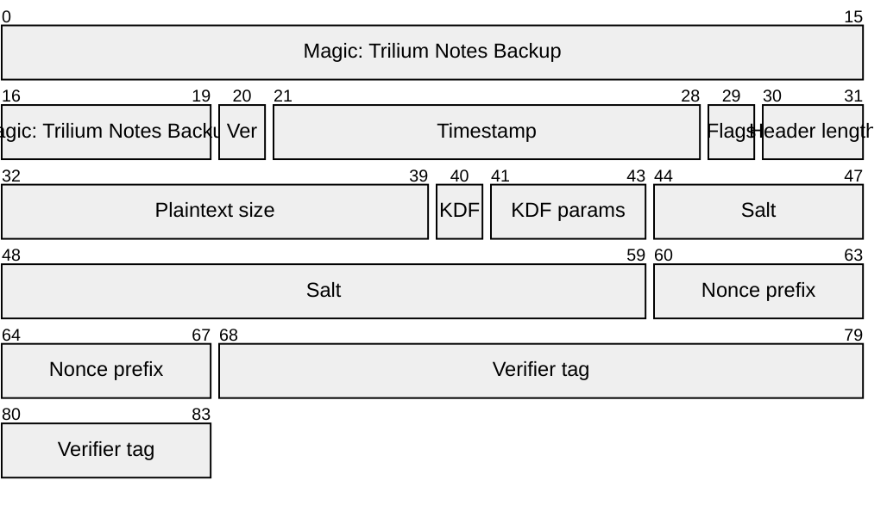
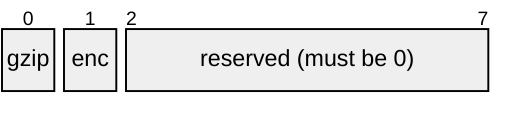
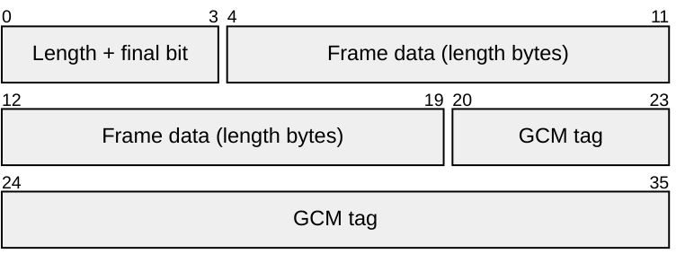
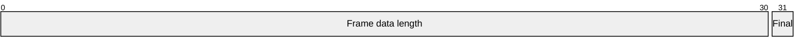

# Notely Backup Container (.tnbackup) file format
A container wraps exactly one SQLite database file, with optional gzip compression and optional AES-256-GCM authenticated encryption. Containers are named `.tnbackup`.

**Every container is written in a single forward pass.** Nothing in one is patched in afterwards, so a destination that cannot be written back to, a download already on its way to the user, holds the format as readily as a file does. That is what puts the payload digest at the end rather than in the header, and it is why even the plainest container, neither compressed nor encrypted, has a hash standing behind its contents.

Whether a backup is a container at all is policy, not format: a writer may skip it and copy a plain `.db` when neither compression nor encryption is asked for.

The **payload** is everything after the header: the wrapped database, in whichever of the four forms the flags select. All integers are little-endian unless stated otherwise. All offsets are absolute byte offsets from the start of the file.

Normative references: gzip is RFC 1952, AES-256-GCM is NIST SP 800-38D, scrypt is RFC 7914, and the SQLite file header is section 1.3 of the SQLite file format specification.

### Header layout

Cells are bytes, 16 per row. The diagram shows an encrypted container. In an unencrypted one the fields from `KDF` through `Verifier tag` are absent, so the header is 40 bytes and the payload starts there.



The **verifier tag is always the last field of the header**. It is written once the key exists, so it is excluded from what it authenticates. Any field added by a later version goes before it and is therefore authenticated, as the timestamp is.

### Fixed header

Always present.

| Offset | Size | Field | Value |
| --- | --- | --- | --- |
| 0 | 20 | Magic | ASCII `Trilium Notes Backup` |
| 20 | 1 | Version | `1`. Version `0` is never valid |
| 21 | 8 | Timestamp | When the backup was taken, in milliseconds since the Unix epoch. `0` when not recorded |
| 29 | 1 | Flags | Bit 0: gzip-compressed. Bit 1: encrypted. Bits 2 to 7 reserved, must be 0 |
| 30 | 2 | Header length | Total header size in bytes, i.e. the offset at which the payload starts |
| 32 | 8 | Plaintext size | Size of the wrapped database in bytes, before compression. `0` when unknown. A hint; the trailer states it authoritatively |

The flags byte, cells are bits:



`Plaintext size` is a hint, never an instruction. It is unauthenticated in an unencrypted container and, in an encrypted one, is only confirmed once the verifier tag has been checked. Readers must not allocate from it, and must not let it widen any bound. When a container is encrypted but not compressed it equals the total payload plaintext length; when compressed, the payload is shorter by the compression ratio, which is therefore disclosed to anyone holding the file. That disclosure is an accepted trade-off for restore progress reporting and the final length check.

### Trailer

The last 40 bytes of every container, and the only part of it that could not be written until the payload was complete.

| Offset from EOF | Size | Field | Value |
| --- | --- | --- | --- |
| \-40 | 32 | Payload digest | SHA-256 over the payload exactly as stored, i.e. bytes `[headerLength, EOF - 40)` |
| \-8 | 8 | Plaintext size | The plaintext length as counted while writing |

The **payload** therefore runs from `headerLength` to `EOF - 40`, not to end of file.

Putting both at the end is what makes the format forward-writable, and forward-writability is what makes the digest unconditional. A digest in the header has to be patched in after the payload is known, which a download or a socket cannot do; at the end it is simply the next thing written. So every container carries one, including the uncompressed unencrypted container that has nothing else standing behind it.

#### Payload digest

It digests the payload **as stored**, not the plaintext. In an encrypted container that means it covers ciphertext, so it reveals nothing that holding the file does not already reveal, and it can be checked by anyone auditing a backup directory.

It is a corruption check, not an authenticity check. It lies outside everything the header authenticates, so an attacker who can rewrite the file can rewrite the digest with it. Tampering is caught by GCM in an encrypted container; the digest exists to catch bit rot, truncated copies and mangled transfers.

Its practical use on the failure path: when the verifier tag does not match, a reader that then finds the digest **intact** knows the file is undamaged and the passphrase is genuinely wrong.

#### Plaintext size

The authoritative one, counted as the payload went past rather than promised in advance. The header's own `Plaintext size` is a hint for what has to be known up front, a `Content-Length` or a progress bar; this is what the output is actually held to. A reader rejects output that does not measure exactly this, and rejects a header hint that is non-zero and disagrees with it.

#### Finding the trailer

Neither end of the format requires seeking.

*   **Encrypted.** Frames are self-delimiting and one carries the final flag, so the trailer is simply the 40 bytes that follow the last frame, and end of file must follow immediately.
*   **Unencrypted.** Nothing announces where the payload stops, so a reader holds the last 40 bytes back as they go past and whatever it is still holding when the input ends is the trailer.

A file too short to contain a trailer is truncated, and says so.

### Derived length

A container that is **not compressed** has a length fixed by its header, because nothing in it varies with content:

```
unencrypted: 40 + plaintextSize + 40
encrypted:   84 + plaintextSize + (floor(plaintextSize / 1048576) + 1) * 20 + 40
```

The encrypted form adds the 4-byte length field and 16-byte tag of every frame, including the empty final frame that a payload of an exact multiple of the frame size still carries. Both forms add the trailer.

Two things follow. A writer knows the exact byte count before it writes anything, which is what lets a download state a `Content-Length` and a browser draw a progress bar. And a reader can compare that figure against the actual file size from the header alone, and reject a file that is short before spending a minute decrypting the part of it that did arrive.

Compression breaks this: the payload is then shorter than the plaintext by a ratio the header does not state, so a compressed container has no predictable length and must not be measured this way.

### Header length

In version 1 the header length is fixed by the flags, and readers must require equality rather than a minimum:

| Flags | Header length |
| --- | --- |
| Bit 1 clear | exactly 40 |
| Bit 1 set | exactly 84 |

A version that appends fields raises the version byte, so an older reader rejects the file on the version check before header length is ever in question. Across all versions two limits hold:

*   A header length beyond a reader's configured maximum, for which 4096 is a sane default, is rejected before anything is allocated or sought.
*   A header length extending past the end of the file is rejected. A reader must never seek past EOF on the strength of an unverified field.

### Identifying a container

What a container is, it states in the clear. The version, the timestamp, both flags and the plaintext size all sit in the first 40 bytes and none of them are encrypted, so a reader can tell a compressed backup from an encrypted one, and date it and size it, **without the passphrase and without touching the payload**. Listing a directory of backups costs 40 bytes a file, whatever the files weigh.

A reader doing only this still applies the same checks as any other: the magic, the version, and the reserved flag bits. What it cannot make sense of it should report as an unidentified file rather than as a failure, so that one damaged container cannot derail a listing.

### Encryption header

Present only when flag bit 1 is set.

| Offset | Size | Field | Value |
| --- | --- | --- | --- |
| 40 | 1 | KDF id | `1` = scrypt. `2` reserved for Argon2id. Other values reserved |
| 41 | 3 | KDF params | Three bytes whose meaning is defined by `KDF id` |
| 44 | 16 | Salt | Random, fresh per file |
| 60 | 8 | Nonce prefix | Random, fresh per file |
| 68 | 16 | Verifier tag | AES-256-GCM tag over an empty plaintext |

#### KDF parameters

The three parameter bytes are interpreted per algorithm, so a future KDF is not forced into scrypt's shape:

| KDF id | Byte 41 | Byte 42 | Byte 43 |
| --- | --- | --- | --- |
| `1` scrypt | log2(N) | r | p |
| `2` and above | Defined when the id is assigned |  |  |

```
key = scrypt(NFC(passphrase) as UTF-8, salt, 32 bytes, { N: 1 << log2N, r, p })
```

The passphrase is the user's backup passphrase, which is not the Notely login password.

**Passphrase encoding is part of the format**: the passphrase is normalised to Unicode NFC and encoded as UTF-8 before it reaches the KDF. Neither JavaScript nor Node normalises implicitly, so an implementation must call `String.prototype.normalize("NFC")` explicitly. Without this, the same passphrase typed with a composed `é` on one machine and a decomposed one on another derives a different key, and the user is told their passphrase is wrong.

The salt is fresh per file, therefore the key is fresh per file, therefore a nonce can never repeat under a key.

Recommended parameters for new files: log2(N) = 17, r = 8, p = 1. Readers must honour the parameters stored in the file rather than their own defaults, within the bounds below.

#### Parameter bounds

A container is untrusted input, and KDF parameters are a resource-exhaustion vector: `log2(N) = 30` asks a reader for more than 128 GiB before a single frame is read. Readers must reject, as an unsupported container:

*   scrypt outside `10 <= log2(N) <= 20`, `1 <= r <= 16`, `1 <= p <= 8`.
*   any parameter set whose derivation cost, `128 * N * r` bytes for scrypt, exceeds the reader's configured memory ceiling.

The ceiling is what actually protects the reader, and it must be applied before the derivation is attempted, not caught afterwards.

> A runtime may also impose a ceiling of its own, below these bounds. Node's `crypto.scrypt` defaults `maxmem` to 32 MiB, which is less than the recommended parameters need, so an implementation must raise it explicitly or every derivation fails. That limit belongs to the platform, not to the format: a container written with parameters one reader refuses is still a valid container.

### Payload

| Flags | Payload |
| --- | --- |
| Neither set | Raw database bytes, between the header and the trailer |
| Compressed only | A single RFC 1952 gzip stream |
| Encrypted | A sequence of frames |
| Both | A sequence of frames whose plaintext is the RFC 1952 gzip stream |

Compression is applied before encryption.

Writers must emit the gzip stream with MTIME 0, no FNAME and no FEXTRA, and OS byte 255. The gzip header would otherwise carry a timestamp, possibly a source path, and the family of the operating system that wrote it, reintroducing in the payload the metadata this format deliberately keeps out of its own header.

The OS byte usually needs setting after the fact. A zlib-based writer emits its build platform's code there — 3 on Unix, 10 on Windows — and typically offers no way to choose it, so the writer has to overwrite byte 9 of the gzip stream as it passes. That is safe: the byte is informational, and the gzip header lies outside the CRC32, which covers the uncompressed data alone. MTIME and the absent FNAME/FEXTRA usually need nothing, being zlib's defaults already.

### Authenticated header

One span, used by both the verifier tag and every frame:

```
authenticatedHeader = header bytes [0, verifierTagOffset)      // [0, 68) in version 1
```

It stops before the verifier tag, because the tag is written once the key exists and cannot cover itself. Everything before it is covered, the timestamp included. The trailer is outside it too, being written after the payload, which costs nothing: its digest is a corruption check that GCM already supersedes for tampering.

It matters that frames exclude the tag. Were a frame's AAD to cover the verifier tag, a single flipped bit in that tag would break every frame in the file, and the recovery below would be impossible.

### Verifier tag

```
nonce     = noncePrefix || uint32LE(0xFFFFFFFF)
aad       = authenticatedHeader
plaintext = empty
tag       = 16 bytes, stored at verifierTagOffset
```

### Frames

```
frame := length (4 bytes, LE) || data (length bytes) || tag (16 bytes)
```

Cells are bytes. The data cell is drawn short: it is `length` bytes, normally 1 MiB.



The length field, cells are bits:



| Field | Meaning |
| --- | --- |
| `length` bits 0 to 30 | Frame data length in bytes. GCM preserves length, so this is both the ciphertext and the plaintext length |
| `length` bit 31 | Final frame flag |
| `tag` | AES-256-GCM tag for this frame |

Frames are numbered from 0 in file order. For frame `i`:

```
nonce_i = noncePrefix (8 bytes) || uint32LE(i)
aad_i   = authenticatedHeader || the 4-byte length field of this frame
```

Because the counter is in the nonce and the length field is in the AAD, every frame is authenticated to both its position and its length. Reordering, duplicating, resizing or splicing frames all fail verification.

Counter `0xFFFFFFFF` is reserved for the verifier and must never be used by a frame.

#### Framing is canonical

One payload has exactly one valid framing:

*   Every frame before the final one carries exactly 1048576 bytes.
*   Exactly one frame has the final flag set, and it is the last frame in the file.
*   The final frame carries 1 to 1048576 bytes, except that it carries 0 bytes when the payload length is 0 or an exact multiple of 1048576.
*   End of file follows the final frame immediately. Trailing bytes make the container invalid.

This constrains framing only. Two containers wrapping identical databases are not byte-identical: the salt and nonce prefix are random per file, and gzip output varies with encoder version and level.

The empty final frame is what lets a writer stream in one pass: frames are sealed as they fill, and the flush seals whatever is left, so a writer never has to know whether more data is coming.

A later version that wants a different frame size must signal it in the header, not vary it silently.

#### Size limits

Usable frame counters run from 0 to `0xFFFFFFFE`, which is 4294967295 frames. At 1 MiB per frame the largest representable payload is just under 4 PiB. Writers must reject a payload that would need more frames than this rather than wrapping the counter, which would repeat a nonce under the file's key.

### Writer requirements

*   Fill salt and nonce prefix from a CSPRNG, independently for every file.
*   Normalise the passphrase to NFC and encode it as UTF-8 before deriving the key.
*   Set `Plaintext size` to the size of the source database, or `0` if it is not known.
*   Set reserved flag bits to 0.
*   Emit frames in counter order with no gaps, framed canonically as above, and stop at the frame counter limit rather than wrapping.
*   Emit exactly one final frame, as the last bytes of the file.
*   Compute the payload digest while streaming and write it, with the plaintext length counted as it went past, as the trailer. Never seek: everything is written once, in order.
*   Count the plaintext for the trailer at the input, before compression or framing, so it records the database's own length rather than what the payload became.

The remaining two apply where the destination is a file. A writer streaming to something else, a download or a socket, has no rename to make atomic, and its output is not durable in any sense the writer controls.

*   Flush and `fsync` the file before renaming it, and `fsync` the containing directory after the rename on POSIX. Rename gives atomicity, not durability; without the flush a crash can leave a zero-length file under the final name, which is worse than no backup because it looks like one.
*   Write to a uniquely named temporary file in the destination directory and rename on success, so that a partial file never carries the final name and two writers cannot share a temporary. The final name is still a collision point, so writers must be serialised by the caller.

### Reader requirements

*   Reject the file unless the first 20 bytes match the magic.
*   Reject version `0`, and reject a version above the reader's own.
*   Reject any reserved flag bit that is set.
*   Reject a header length that is not the exact value this version and these flags require, that exceeds the configured maximum, or that extends past the end of the file.
*   When encrypted, reject an unknown KDF id, reject out-of-bounds KDF parameters, then check the verifier tag before reading any frame.
*   Reject a frame whose claimed length exceeds 1048576, **before** reading its data. The length field can claim up to 2 GiB, and a reader that trusts it buffers that much before the tag check fails.
*   Reject a non-final frame whose length is not 1048576.
*   Verify each frame's tag before emitting any of its plaintext.
*   Reject any frame that follows the final frame, and any trailing bytes after it.
*   Reject end of file that is not preceded by a final frame.
*   Stop the payload at the trailer, not at end of file: after the final frame when encrypted, and by holding the last 40 bytes back when not.
*   Verify the payload digest over the bytes as read, and reject a mismatch. Every container has one.
*   Reject output whose length disagrees with the trailer's `Plaintext size`, and reject a header `Plaintext size` that is non-zero and disagrees with the trailer's.
*   Never allocate from `Plaintext size`. Stream the output and compare lengths at the end.
*   Reject a file with no room for a trailer, and any bytes following it.
*   Where a container is not compressed, its total length is derived from its header, so a file shorter than that is incomplete and may be rejected before any of it is read.
*   Apply a configured output ceiling to decompression **always**, and abort before the excess bytes reach the disk. A non-zero `Plaintext size` may only tighten that bound, never widen it: the field is unauthenticated in an unencrypted container, so a crafted value would otherwise disable the ceiling entirely.
*   Let the AEAD implementation verify tags. Where a tag is compared explicitly, the comparison must be constant-time.
*   Check the SQLite header of the output, as described below.

#### SQLite header check

Cheap, and it catches a container that wrapped something other than a database:

*   Bytes 0 to 15 are the magic `SQLite format 3\0`, hex `53514c69746520666f726d6174203300`.
*   Bytes 16 to 17 are the page size, a **big-endian** `uint16`. It must be a power of two between 512 and 32768, or the value `1`, which encodes a page size of 65536. A plain `<= 65536` bound wrongly rejects a 64 KiB-page database, since 65536 does not fit in the field.

#### Rejection conditions

| Condition | Reported as |
| --- | --- |
| Magic mismatch | Not a Notely backup container |
| Version `0` | Not a valid container |
| Version above the reader's | Written by a newer Notely |
| Reserved flag bit set, unknown KDF id, or out-of-bounds KDF parameters | Unsupported container |
| Header length wrong, too large, or past EOF | Not a valid container |
| Verifier tag mismatch | Wrong backup passphrase, or the header is damaged |
| Frame tag mismatch | Damaged at byte offset N |
| Frame length out of range | Damaged at byte offset N |
| Data after the trailer | Damaged |
| End of file without a final frame | Incomplete or truncated |
| Payload digest mismatch | Damaged |
| File too short to hold a trailer | Incomplete or truncated |
| File shorter than an uncompressed container's derived length | Incomplete or truncated |
| Output length disagrees with the trailer's `Plaintext size` | Incomplete or truncated |
| Header `Plaintext size` disagrees with the trailer's | Damaged |
| Output fails the SQLite header check | Damaged |

A verifier mismatch alone cannot distinguish a wrong passphrase from a bit flip in the salt, nonce prefix or tag. Two recoveries follow from the header layout:

*   Check the payload digest. Intact means the passphrase really is wrong.
*   Skip the verifier and attempt frame 0. This succeeds when the damage was confined to the verifier tag, because the tag lies outside the authenticated header.

### Version history

| Version | Change |
| --- | --- |
| 1 | Initial format |

The format was reshaped before it shipped, and the version byte was deliberately left at 1: no container written by the old layout exists outside development, so there was nothing to stay compatible with. The two layouts are in any case distinguishable by header length, 64 or 108 against 40 or 84, should anything ever need to tell them apart.

Extension rules:

*   Fields may only be appended, before the verifier tag and payload digest, and the version byte is raised when they are. `Header length` locates the payload without parsing the fields, and the authenticated header covers appended fields automatically.
*   Reserved flag bits may be assigned meanings without raising the version, because older readers already reject a bit they do not know. Prefer a flag over a version bump for anything that does not change the layout: it keeps every unaffected file readable by every existing reader.
*   A flag that changes what a reader must verify must say what stands in for the check it removes, and the substitute must be mandatory rather than advisory. Prefer not to have one: a check that every container carries is worth more than a flag that lets some of them skip it.
*   Fields that are only knowable once the payload is written belong in the trailer, never in the header, so that no writer ever has to seek and every destination can hold the format.
*   Version `0` is never valid, because it is what a zero-filled or truncated file produces.
*   The authenticated header is included in every frame's AAD verbatim, which is 68 bytes in version 1 and therefore free. A version that grows it to kilobytes should switch the frame AAD to a digest of it, so that per-frame authentication stays constant-cost.